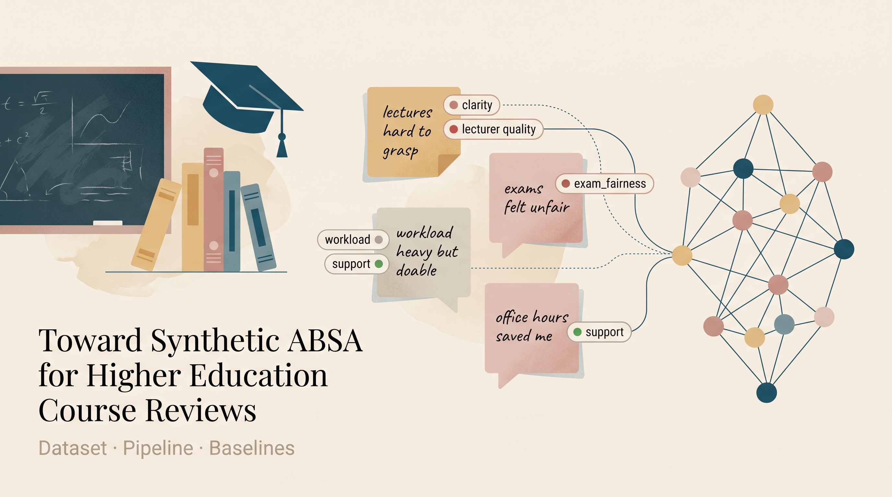

# Toward Synthetic ABSA for Higher Education Course Reviews

A dual-pipeline study of (1) **synthetic student-review generation** with aspect-level
sentiment labels, and (2) an **ABSA analysis pipeline** that detects aspects and
estimates per-aspect sentiment polarity from those reviews.



> **Status:** draft manuscript, internal validation only.
> **Manuscript (rendered):** [`paper/course_absa_manuscript.html`](paper/course_absa_manuscript.html)
> once GitHub Pages is published, the same draft is served at the project's Pages URL.

---

## Abstract

Manual annotation for aspect-based sentiment analysis (ABSA) in higher education is
expensive, domain-specific, and difficult to scale across diverse writing styles. This
project studies a synthetic-data-centred workflow that pairs two contributions:

1. a **local LLM pipeline** that generates labeled student course reviews with
   aspect-level sentiment annotations, and
2. an **ABSA analysis pipeline** that detects aspects and regresses sentiment polarity
   for each detected aspect.

The released dataset contains **5,984 cleaned reviews** (from 6,000 generated records),
covers **10 educational aspects**, and averages **2 labeled aspects per review**.
The repository's BERT notebook reports per-aspect precision in the range
**0.7342&ndash;1.0000** and sentiment MSE in **0.0107&ndash;0.1239** on a separate cleaned
split. A reproducible TF-IDF baseline added on the released JSONL averages
**micro-F1 = 0.598 &plusmn; 0.014** across three seeds and improves monotonically with more
synthetic training data.

The current evidence supports **internal learnability and stylistic diversity** of the
synthetic corpus. It does **not** yet support claims of transfer to real student
feedback, and the manuscript is framed accordingly.

---

## Key claims and what they rest on

| Claim                                                                                          | Evidence                                                                                          |
|------------------------------------------------------------------------------------------------|---------------------------------------------------------------------------------------------------|
| The synthetic corpus is multi-aspect, multi-style, and short-form by design.                   | [paper/outputs/dataset_summary.json](paper/outputs/dataset_summary.json), Figures 1&ndash;3 of the manuscript. |
| The corpus is internally learnable with both classical and transformer ABSA pipelines.         | TF-IDF multi-seed baseline + recorded BERT notebook results.                                      |
| Performance improves with more synthetic training data.                                        | Learning-curve study (Figure 6).                                                                  |
| Persona diversity yields non-trivial held-out-style robustness.                                | Style-holdout experiment (Figure 7).                                                              |
| The pipeline is **not yet** validated against real student feedback.                           | [paper/reviewer_gap_plan.md](paper/reviewer_gap_plan.md) and the manuscript's limitations section.|

---

## Dataset

**File:** [`edu/final_student_reviews.jsonl`](edu/final_student_reviews.jsonl) &nbsp;&middot;&nbsp;
JSONL, one review per line.

**Schema:**

```json
{
  "course_name": "Computer Networks",
  "lecturer": "Prof. Klein",
  "grade": "D (Barely passed)",
  "style": "Confused Student",
  "aspects": { "workload": "neutral", "exam_fairness": "negative" },
  "review_text": "so is this course worth it? workload's okay i guess but the exam made no sense..."
}
```

**Aspect inventory (10):** `clarity`, `difficulty`, `exam_fairness`, `interest`,
`lecturer_quality`, `materials`, `overall_experience`, `relevance`, `support`,
`workload`. Sentiment values: `positive`, `neutral`, `negative`.

**Summary statistics** (cleaned set of 5,984 reviews):

| metric                  | value |
|-------------------------|-------|
| reviews                 | 5,984 |
| courses / lecturers     | 14 / 8 |
| aspects                 | 10 |
| mean / median words     | 14.0 / 9 |
| mean aspects per review | 2.0 |
| word range              | 1&ndash;60 |

---

## Methodology in brief

**Synthetic generation pipeline** (`edu/`):
balanced parameter sampling (grade, course, lecturer, style, aspect targets) &rarr;
constraint-rich prompt (forbidden phrases, persona rules) &rarr;
**pass 1** draft via local Llama&nbsp;3 (Ollama) &rarr;
**pass 2** refinement to repair label mismatches &rarr;
noise injection (typos, casing, slang) &rarr; JSONL.

**ABSA analysis pipeline** (`paper/`):
`bert-base-uncased` encoder &rarr; 10 binary aspect heads (BCE) &rarr;
10-dim sentiment regression head in [-1, 1] (masked MSE) &rarr;
per-aspect threshold calibration on a held-out split &rarr;
per-aspect evaluation (accuracy, precision, recall, MSE).

A non-neural TF-IDF + logistic regression / ridge baseline is reproducible from
[`paper/edu_absa_paper_analysis.py`](paper/edu_absa_paper_analysis.py); a transformer
benchmark across BERT / DistilBERT / RoBERTa / ALBERT is in
[`paper/absa_model_comparison.py`](paper/absa_model_comparison.py).

---

## Headline results

**Recorded BERT notebook (separate cleaned split, n=5,052; 4,041 / 505 / 506):**

| aspect              | precision | recall | MSE    | threshold |
|---------------------|-----------|--------|--------|-----------|
| `exam_fairness`     | 1.0000    | 1.0000 | 0.0166 | 0.95      |
| `materials`         | 0.9700    | 0.9898 | 0.0253 | 0.65      |
| `support`           | 0.9639    | 0.9639 | 0.0107 | 0.85      |
| `workload`          | 0.9200    | 0.9684 | 0.0478 | 0.30      |
| `clarity`           | 0.9379    | 0.9379 | 0.0311 | 0.75      |
| `lecturer_quality`  | 0.8889    | 0.9143 | 0.0693 | 0.10      |
| `interest`          | 0.8636    | 0.9048 | 0.0207 | 0.70      |
| `difficulty`        | 0.8652    | 0.8750 | 0.1239 | 0.80      |
| `relevance`         | 0.7857    | 0.9296 | 0.0501 | 0.30      |
| `overall_experience`| 0.7342    | 0.8406 | 0.0159 | 0.30      |

Source: [paper/outputs/recorded_notebook_test_results.csv](paper/outputs/recorded_notebook_test_results.csv).

**TF-IDF baseline on the released JSONL (3 seeds, 80/10/10 train/calib/test):**

| metric                              | mean   | std    |
|-------------------------------------|--------|--------|
| detection micro-F1                  | 0.5979 | 0.0140 |
| detection macro-F1                  | 0.6048 | 0.0130 |
| sentiment MSE on detected aspects   | 0.4329 | 0.0292 |
| sentiment polarity accuracy         | 0.5214 | 0.0210 |

Source: [paper/outputs/baseline_seed_summary.json](paper/outputs/baseline_seed_summary.json).

**Learning curve (released JSONL, single seed):**
detection micro-F1 rises from **0.5621** at 25% training data to **0.5945** at 100%;
sentiment MSE drops from **0.4777** to **0.4005** over the same range.
See [Figure 6](paper/outputs/figures/learning_curve.png).

**Style-holdout robustness:**
best on *casual texting* (micro-F1 = 0.6835), worst on *confused student*
(micro-F1 = 0.5060). See [Figure 7](paper/outputs/figures/style_holdout_micro_f1.png).

---

## Repository layout

```
.
├── README.md                          # this file
├── assets/hero.png                    # README banner
├── index.html                         # GitHub Pages entry → manuscript
├── .nojekyll                          # disable Jekyll on Pages
├── edu/                               # synthetic data generation
│   ├── final_student_reviews.jsonl    # released dataset (6,000 records, 5,984 clean)
│   ├── dataset_generator.ipynb
│   ├── dataset_generator_balanced.ipynb
│   ├── absa_train_new.ipynb           # BERT ABSA training notebook
│   ├── LLMDemo.ipynb
│   └── ReadMe.md                      # generation pipeline notes
└── paper/                             # paper artifacts
    ├── course_absa_manuscript.html    # rendered draft manuscript
    ├── edu_absa_paper_analysis.py     # EDA + TF-IDF baselines + learning curve
    ├── absa_model_comparison.py       # transformer + OpenAI-prompt benchmark
    ├── realism_validation_experiment.py  # real-vs-synthetic LLM-judge protocol
    ├── reviewer_gap_plan.md           # self-assessment of evidence boundaries
    ├── validation_protocol.md         # realism validation plan
    ├── outputs/                       # CSVs and figures used in the manuscript
    └── validation/                    # OMSCS real-review samples + judge protocol
```

---

## Reproducing the analysis

The released JSONL is the canonical input for every analysis script.

```bash
# Python 3.9+ recommended. Suggested:
pip install numpy pandas scikit-learn matplotlib seaborn

# EDA + TF-IDF baselines + learning curve + style-holdout
python paper/edu_absa_paper_analysis.py

# Transformer benchmark (BERT / DistilBERT / RoBERTa / ALBERT)
# Adds an OpenAI-prompt baseline if .opeai.key is present.
pip install torch transformers
python paper/absa_model_comparison.py
```

Outputs land in [`paper/outputs/`](paper/outputs/) (CSVs and figures referenced by the
manuscript). The transformer benchmark writes to `paper/benchmark_outputs/`.

---

## Scope and limitations (the honest list)

What the current evidence supports:

- **A learnable, stylistically diverse synthetic ABSA corpus** for higher-education
  reviews, with internally consistent BERT and TF-IDF baselines.
- **Monotonic gains** with more synthetic training data.
- **Non-trivial style robustness** in held-out-style evaluation.

What it does **not** yet support, and what is therefore out of scope for this draft:

- Generalization from synthetic reviews to **real student feedback**. The realism
  validation experiment ([`paper/realism_validation_experiment.py`](paper/realism_validation_experiment.py))
  is implemented but its first cycle did not complete because the OpenAI judge call
  hit `insufficient_quota`; see
  [`paper/validation/prompt_debug_cycle_0_status.json`](paper/validation/prompt_debug_cycle_0_status.json).
- Claims that the **two-pass refinement** is necessary &mdash; this needs an ablation.
- Replacement of human annotation by synthetic labels &mdash; this needs human
  evaluation of realism, aspect correctness, and sentiment faithfulness.

The reviewer-facing gap plan is in [`paper/reviewer_gap_plan.md`](paper/reviewer_gap_plan.md).

---

## Citation

Until a venue is fixed, please cite the draft as a working paper:

```bibtex
@misc{aperstein2026courseabsa,
  title  = {Toward Synthetic Aspect-Based Sentiment Analysis for Higher Education
            Course Reviews: A Dual-Pipeline Study of Data Generation and ABSA Modeling},
  author = {Aperstein, Yehudit and Apartsin, Alexander},
  year   = {2026},
  url    = {https://github.com/ApartsinProjects/AbsaCourses}
}
```

---

## Acknowledgements

Local LLM inference uses [Ollama](https://ollama.com/) with Llama&nbsp;3.
Real-review validation samples are drawn from the public
[OMSCS Reviews](https://awaisrauf.com/omscs_reviews/) pages (CS-6200, CS-6250,
CS-6400, CS-7641) for research and evaluation only.
